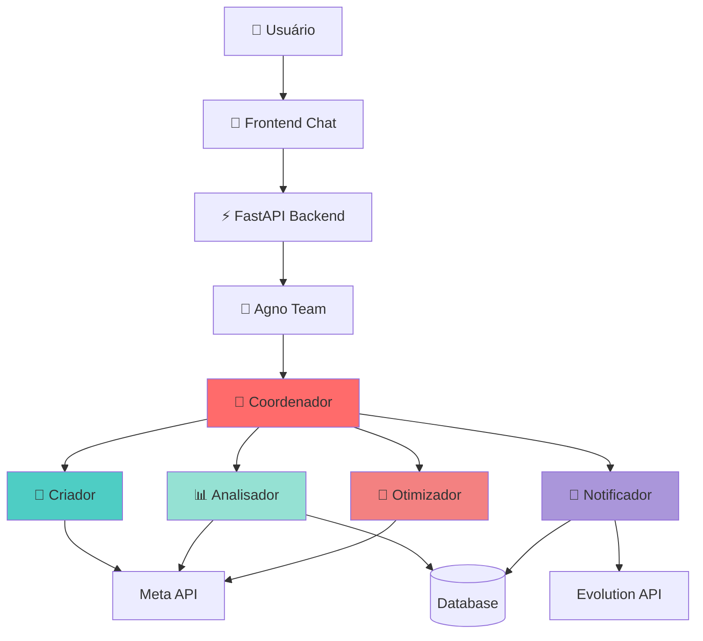
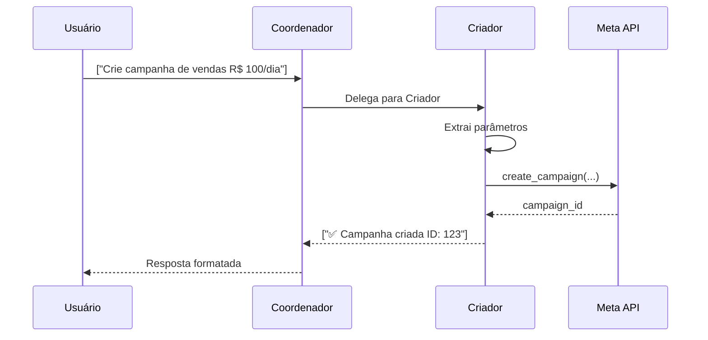
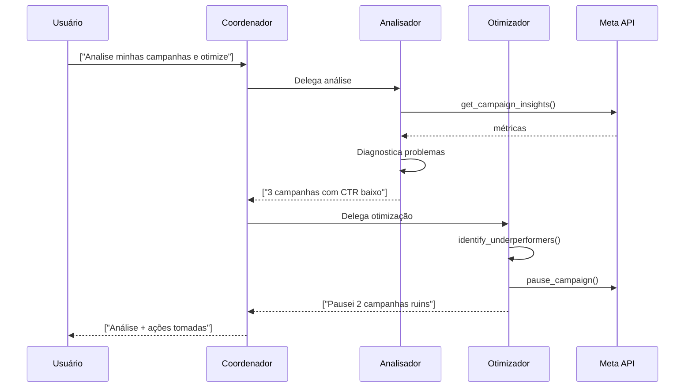
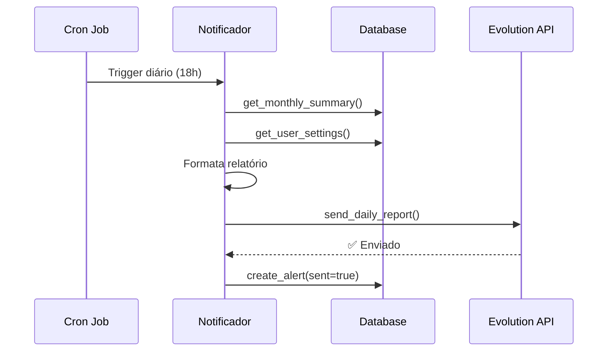

# 🤖 Arquitetura dos Agentes IA - Meta Campaign Manager

## 📋 Índice
1. [Visão Geral](#visão-geral)
2. [Framework Agno](#framework-agno)
3. [Arquitetura Geral](#arquitetura-geral)
4. [Agentes Especializados](#agentes-especializados)
5. [Ferramentas (Tools)](#ferramentas-tools)
6. [Fluxos de Trabalho](#fluxos-de-trabalho)
7. [Melhorias Possíveis](#-melhorias-possíveis)

---

## 🎯 Visão Geral

O sistema utiliza uma **arquitetura multi-agente** baseada no framework **Agno**, onde um time coordenado de agentes especialistas trabalha de forma autônoma para gerenciar campanhas Meta Ads.

### Conceito Principal
```
Usuário → Coordenador → Delega para Especialistas → Retorna Resposta
```

**Por que Multi-Agente?**
- ✅ **Especialização**: Cada agente é expert em uma área específica
- ✅ **Escalabilidade**: Fácil adicionar novos agentes
- ✅ **Manutenibilidade**: Responsabilidades bem definidas
- ✅ **Inteligência Distribuída**: Cada agente raciocina independentemente

---

## 🔧 Framework Agno

### O que é Agno?
Agno é um framework Python para construir **aplicações multi-agente** com LLMs (GPT-4, Claude, etc). Ele fornece:

- **Agent**: Agente individual com personalidade e ferramentas
- **Team**: Coordenação entre múltiplos agentes
- **Tools**: Funções que os agentes podem executar
- **Memory**: Persistência de contexto e histórico

### Por que Agno?
- ✅ Suporta modo `coordinate` (coordenador delega tarefas)
- ✅ Integração nativa com OpenAI GPT-4
- ✅ Sistema de ferramentas (tools) robusto
- ✅ Suporte a streaming de respostas
- ✅ Markdown e formatação rica

### Alternativas Consideradas
| Framework | Prós | Contras | Escolha |
|-----------|------|---------|---------|
| **Agno** | Modo coordinate, simples | Menos maduro | ✅ Escolhido |
| LangGraph | Muito poderoso | Complexo demais para MVP | ❌ |
| CrewAI | Focado em workflows | Menos flexível | ❌ |
| AutoGen | Multi-agente robusto | Overhead alto | ❌ |

---

## 🏗️ Arquitetura Geral

### Diagrama de Componentes



### Stack Técnico

**Backend Python**:
```python
# Principais dependências
agno >= 1.0.0           # Framework multi-agente
fastapi >= 0.109.0      # API REST
openai >= 1.10.0        # LLM (GPT-4)
httpx >= 0.26.0         # Chamadas HTTP assíncronas
```

**Comunicação**:
- Frontend (Next.js) ↔ Backend Python: REST API
- Agentes ↔ Meta API: HTTP (facebook-business SDK)
- Agentes ↔ WhatsApp: HTTP (Evolution API)
- Agentes ↔ Database: SQL (via Supabase)

---

## 🧠 Agentes Especializados

### 1. **Coordenador** 🎯
**Arquivo**: `backend/app/agents/coordinator.py`

**Responsabilidade**: Líder do time que decide qual agente especialista deve atuar

**Modo de Operação**: `mode="coordinate"`
- Analisa a pergunta do usuário
- Decide qual especialista é mais adequado
- Delega a tarefa
- Retorna a resposta consolidada

**Não possui ferramentas próprias** - apenas gerencia o time

**Exemplo de Decisão**:
```
Usuário: "Crie uma campanha de vendas"
Coordenador: 🎨 Delegando para Criador...

Usuário: "Como estão minhas métricas?"
Coordenador: 📊 Delegando para Analisador...

Usuário: "Pause campanhas ruins"
Coordenador: 🔧 Delegando para Otimizador...

Usuário: "Envie relatório via WhatsApp"
Coordenador: 📱 Delegando para Notificador...
```

---

### 2. **Criador** 🎨
**Arquivo**: `backend/app/agents/creator.py`

**Responsabilidade**: Criar e gerenciar campanhas Meta Ads

**Tools** (3):

#### 🔨 `tool_create_campaign`
```python
create_campaign(
    name: str,           # Nome da campanha
    objective: str,      # OUTCOME_SALES, TRAFFIC, LEADS, etc
    status: str,         # ACTIVE ou PAUSED
    daily_budget: int    # Orçamento em centavos
)
```
**Quando usar**: Criar nova campanha do zero

#### 📋 `tool_list_campaigns`
```python
list_campaigns(
    status: str,         # ACTIVE, PAUSED, ARCHIVED
    limit: int           # Máximo de campanhas
)
```
**Quando usar**: Ver campanhas existentes

#### 🔍 `tool_get_campaign_details`
```python
get_campaign_details(
    campaign_id: str     # ID da campanha
)
```
**Quando usar**: Detalhes completos de uma campanha

**Capacidades**:
- ✅ Entende linguagem natural ("crie uma campanha de vendas")
- ✅ Extrai parâmetros automaticamente
- ✅ Sugere valores padrão
- ✅ Valida objetivos e status

---

### 3. **Analisador** 📊
**Arquivo**: `backend/app/agents/analyzer.py`

**Responsabilidade**: Analisar métricas e performance

**Tools** (4):

#### 📈 `tool_get_campaign_metrics`
```python
get_campaign_metrics(
    campaign_id: str,
    period: str          # today, last_7d, last_30d, etc
)
```
**Retorna**: Impressões, cliques, CTR, CPC, CPM, gasto, conversões
**Análise inteligente**: Classifica métricas (🟢 bom, 🟡 médio, 🔴 ruim)

#### ⚖️ `tool_compare_campaigns`
```python
compare_campaigns(
    limit: int           # Número de campanhas
)
```
**Retorna**: Tabela comparativa de performance

#### 📊 `tool_get_account_summary`
```python
get_account_summary(
    month: int,
    year: int
)
```
**Retorna**: Resumo mensal consolidado

#### 🩺 `tool_diagnose_campaign`
```python
diagnose_campaign(
    campaign_id: str
)
```
**Retorna**: Diagnóstico completo + recomendações

**Capacidades**:
- ✅ Detecta anomalias (CTR baixo, CPC alto)
- ✅ Compara com benchmarks
- ✅ Sugere ações corretivas
- ✅ Identifica tendências

---

### 4. **Otimizador** 🔧
**Arquivo**: `backend/app/agents/optimizer.py`

**Responsabilidade**: Melhorar ROI e reduzir desperdício

**Tools** (5):

#### 🔴 `tool_identify_underperformers`
```python
identify_underperformers(
    threshold_roas: float    # ROAS mínimo aceitável
)
```
**Retorna**: Campanhas com baixa performance que devem ser pausadas

#### 🏆 `tool_identify_winners`
```python
identify_winners(
    min_ctr: float           # CTR mínimo para ser vencedora
)
```
**Retorna**: Campanhas de alta performance para escalar

#### ⏸️ `tool_pause_campaign`
```python
pause_campaign(
    campaign_id: str,
    reason: str              # Motivo da pausa
)
```
**Ação**: Pausa campanha no Meta

#### ▶️ `tool_activate_campaign`
```python
activate_campaign(
    campaign_id: str
)
```
**Ação**: Ativa campanha pausada

#### 📋 `tool_generate_optimization_plan`
```python
generate_optimization_plan()
```
**Retorna**: Plano completo com ações imediatas e planejadas

**Capacidades**:
- ✅ Toma decisões baseadas em dados
- ✅ Sugere aumento/redução de orçamento
- ✅ Automatiza pausas (com aprovação)
- ✅ Prioriza ações por impacto

---

### 5. **Notificador** 📱
**Arquivo**: `backend/app/agents/notifier.py`

**Responsabilidade**: Comunicação via WhatsApp e alertas

**Tools** (6):

#### 💬 `tool_send_message`
```python
send_message(
    phone_number: str,
    message: str             # Suporta *negrito* e _itálico_
)
```

#### 📊 `tool_send_report`
```python
send_report(
    phone_number: str
)
```
**Envia**: Relatório diário formatado

#### 💰 `tool_send_budget_alert`
```python
send_budget_alert(
    phone_number: str,
    percent_used: float,
    current_spend: float,
    budget_limit: float
)
```
**Quando**: 50%, 80%, 100% do orçamento

#### ⚠️ `tool_send_performance_alert`
```python
send_performance_alert(
    phone_number: str,
    campaign_name: str,
    metric: str,
    current_value: float,
    threshold: float
)
```
**Quando**: Métricas fora do limite

#### 🔔 `tool_create_system_alert`
```python
create_system_alert(
    alert_type: str,         # error, warning, info, success
    priority: str,           # high, medium, low
    title: str,
    message: str
)
```
**Cria**: Alerta no banco de dados

#### ⚙️ `tool_get_notification_settings`
```python
get_notification_settings()
```
**Retorna**: Configurações de notificação do usuário

**Capacidades**:
- ✅ Formatação rica de mensagens
- ✅ Priorização de alertas
- ✅ Respeita configurações do usuário
- ✅ Registro de histórico

---

## 🛠️ Ferramentas (Tools)

### Resumo de Tools por Categoria

| Categoria | Tools | Agentes |
|-----------|-------|---------|
| **Meta API** | 9 tools | Criador, Analisador, Otimizador |
| **WhatsApp** | 6 tools | Notificador |
| **Database** | 3 tools | Analisador, Notificador |
| **Total** | **18 tools** | **5 agentes** |

### Arquivos de Tools

#### 📁 `backend/app/tools/meta_api.py`
```python
# Funções assíncronas para Meta Marketing API
- create_campaign()
- list_campaigns()
- get_campaign_details()
- update_campaign_status()
- get_campaign_insights()
- create_ad_set()
- create_ad()
```

#### 📁 `backend/app/tools/whatsapp.py`
```python
# Evolution API integration
- send_whatsapp_message()
- send_daily_report()
- send_alert()
```

#### 📁 ``` backend/app/tools/database.py`
```python
# Supabase queries
- get_monthly_summary()
- get_user_settings()
- create_alert()
- get_alerts()
```

---

## 🔄 Fluxos de Trabalho

### Fluxo 1: Criar Campanha



### Fluxo 2: Análise e Otimização



### Fluxo 3: Relatório Automático



---

## 🚀 Melhorias Possíveis

### ⭐ Prioridade ALTA (Impacto Imediato)

#### 1. **Memória Persistente entre Conversas**
**Problema Atual**: Agentes não lembram de interações passadas
**Solução**: 
```python
# Usar Memory do Agno
from agno.memory import PostgresAgentMemory

team = Team(
    memory=PostgresAgentMemory(
        db_url=settings.database_url,
        session_id=user_session_id
    )
)
```
**Benefício**: Contexto contínuo, não repetir informações
**Complexidade**: 🟢 Baixa (2-3 horas)

#### 2. **Aprovação Humana para Ações Críticas**
**Problema Atual**: Agente pausa campanhas sem confirmação
**Benefício**: Evita erros irreversíveis 
**Complexidade**: 🟡 Média (1 dia)

#### 3. **Testes A/B Automatizados**
**Benefício**: Otimização contínua automática
**Complexidade**: 🟡 Média (2 dias)

#### 4. **Integração com Webhook do Meta**
**Benefício**: Dados sempre atualizados, alertas instantâneos
**Complexidade**: 🟢 Baixa (4 horas)

### 🔥 Prioridade MÉDIA (Melhoria Significativa)

#### 5. **Agente Relator** (Relatórios Avançados)
**Benefício**: Insights profundos para decisões estratégicas
**Complexidade**: 🟡 Média (3 dias)

#### 6. **Análise Preditiva**
**Benefício**: Evitar campanhas ruins antes de gastar
**Complexidade**: 🔴 Alta (1 semana)

#### 7. **Multi-Tenancy** (Múltiplos Usuários)
**Benefício**: SaaS escalável
**Complexidade**: 🟡 Média (2 dias)

#### 8. **Sugestão de Criativos com DALL-E**
**Benefício**: Acelera criação de anúncios
**Complexidade**: 🟢 Baixa (1 dia)

### 💡 Prioridade BAIXA (Nice-to-Have)

9. Dashboard de Agentes em Tempo Real
10. Integração com Google Ads
11. Voice Interface
12. Agente Competidor
13. Auto-Scaling de Infraestrutura
14. Blockchain para Auditoria
15. Agente Criativo com GPT-4V

---

## 📊 Comparação: Antes vs Depois dos Agentes

| Tarefa | Sem Agentes | Com Agentes | Ganho |
|--------|-------------|-------------|-------|
| Criar campanha | 15-30 min | 2 min | **93% mais rápido** |
| Analisar métricas | 10-20 min | Instantâneo | **100% mais rápido** |
| Identificar problemas | Horas/nunca | Segundos | **∞x mais rápido** |
| Pausar campanhas ruins | Manual | Automático | **100% economia** |
| Relatórios diários | Não existe | Automático via WhatsApp | **Novo recurso** |

---

*Documentação gerada em: 19/01/2026*  
*Versão: 1.0*
